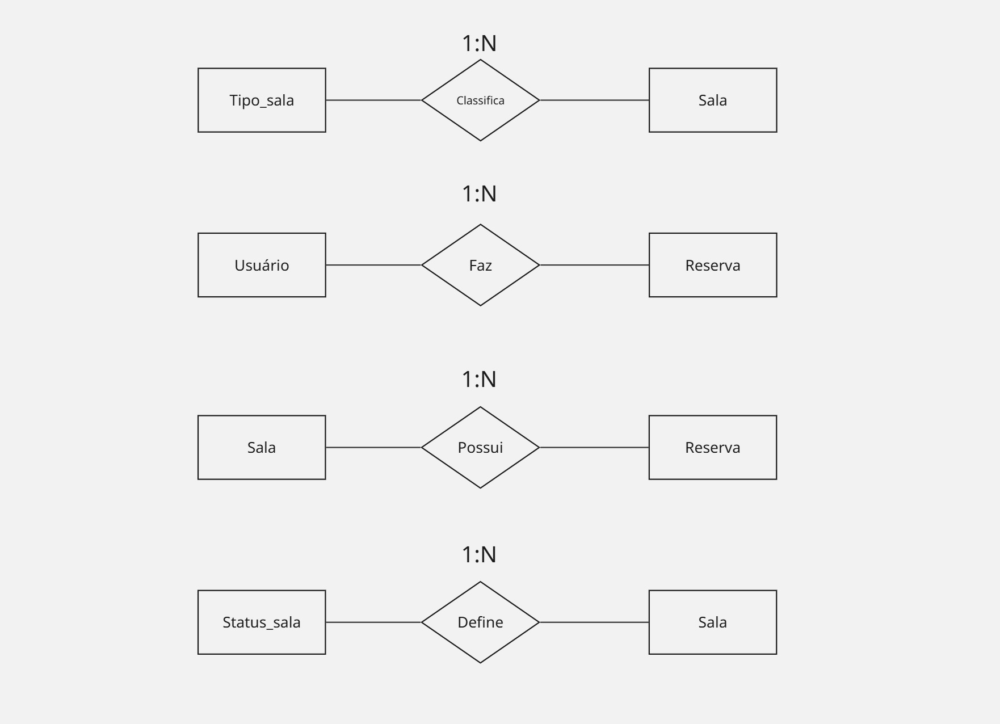
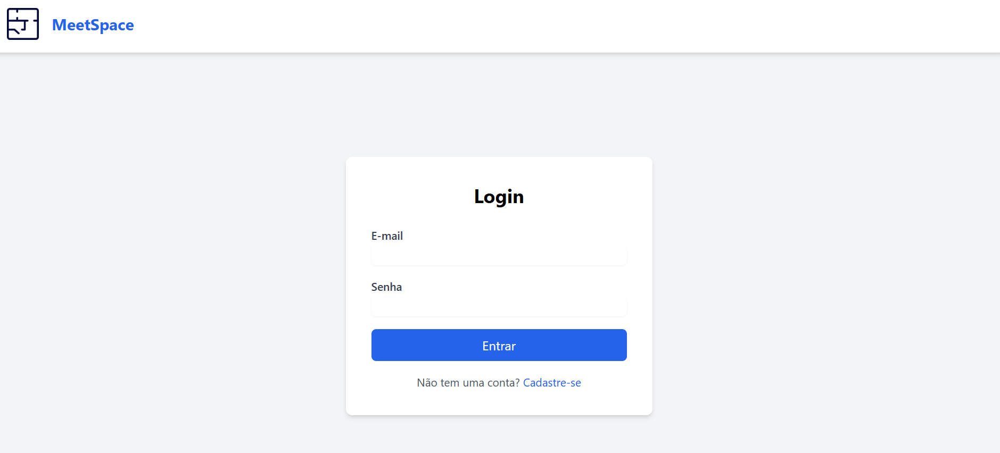
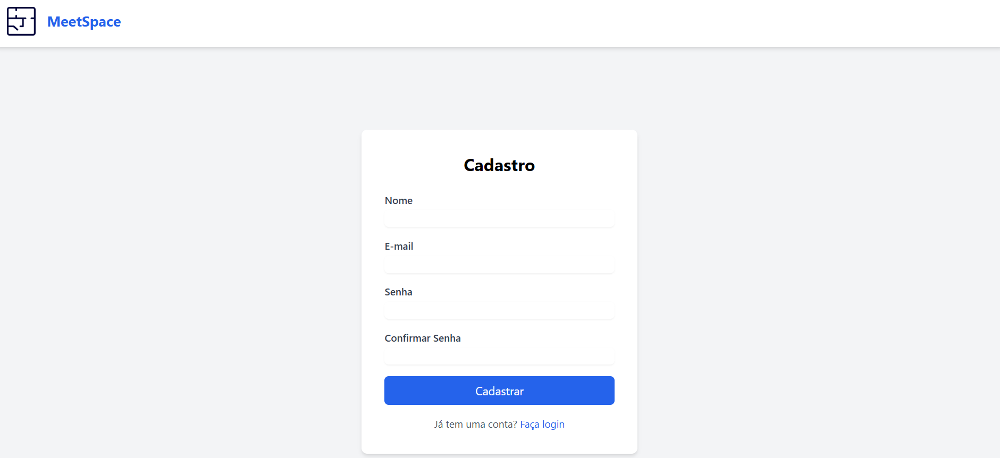
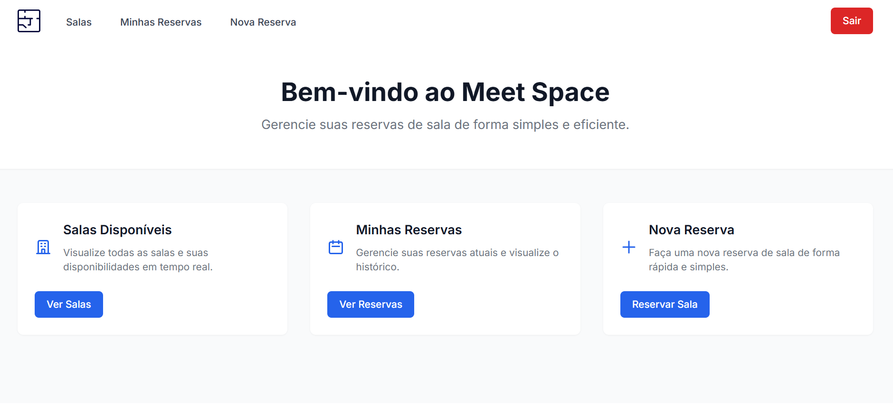
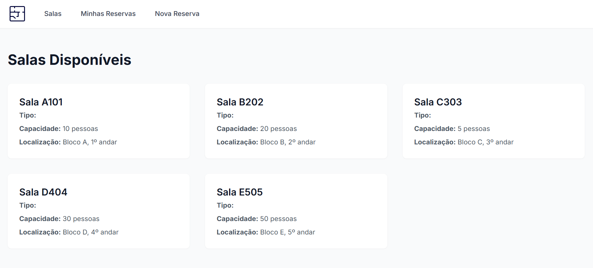
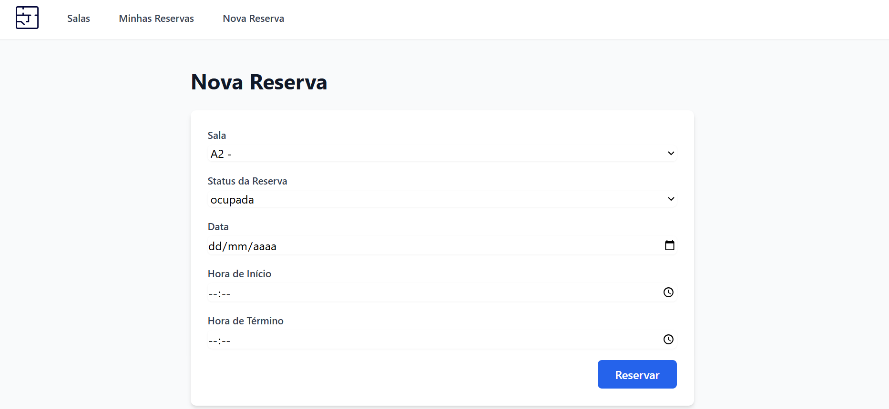
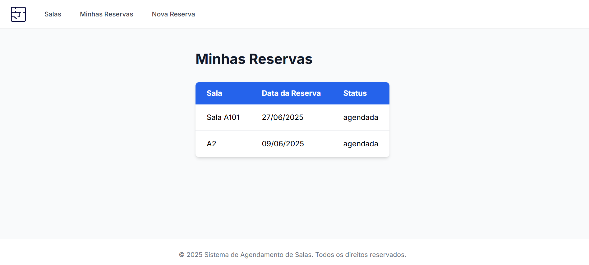

# WAD - Web Application Document - Módulo 2 - Inteli

## 1. Introdução
A gestão de espaços compartilhados em instituições de ensino é uma tarefa que exige organização, controle e acessibilidade às informações em tempo real. A dificuldade na visualização da disponibilidade de salas, bem como a ocorrência de conflitos de agendamento, são problemas comuns enfrentados diariamente. Pensando nisso, este projeto propõe o desenvolvimento de uma aplicação web voltada para o agendamento de salas, com o objetivo de otimizar esse processo, oferecer uma experiência mais eficiente aos usuários e garantir o uso adequado dos recursos da instituição.

## 2. Diagrama do banco de dados

### 2.1. Modelo Conceitual

A modelagem conceitual é a primeira etapa do processo de modelagem de dados, voltada para representar, de forma abstrata e independente da tecnologia, os elementos e relacionamentos que compõem um sistema. Seu principal objetivo é capturar e organizar os requisitos do negócio por meio de entidades, atributos e relacionamentos, geralmente representados por diagramas ER (entidade-relacionamento). Nessa fase, não se define como os dados serão armazenados, apenas o que precisa ser armazenado, permitindo uma compreensão clara e compartilhada do funcionamento lógico da aplicação antes de se pensar na implementação.

<div align="center">
   <sub>Imagem 1: Diagrama Modelo Conceitual</sub><br>
   <br>
   <sup>Representação da relação entre as entidades</sup>
 </div>

As entidades do sistema de agendamento de salas estão relacionadas de forma a representar com clareza as interações entre usuários, salas e reservas. Cada usuário pode realizar diversas reservas, configurando uma relação de um-para-muitos entre as entidades usuario e reserva. A entidade sala, por sua vez, também se relaciona com reserva de forma semelhante, pois uma mesma sala pode ser reservada várias vezes em horários distintos. Já a entidade status_reserva define os estados possíveis de uma reserva (como “pendente”, “confirmada” ou “cancelada”), sendo referenciada por cada registro de reserva para indicar sua situação atual. Por fim, a entidade tipo_sala permite classificar as salas conforme suas finalidades (como laboratório, auditório ou sala de aula), mantendo uma relação de um-para-muitos com a entidade sala. Essas relações garantem consistência e flexibilidade na estrutura do banco de 


### 2.2. Modelo Físico

A modelagem física é a etapa que transforma os modelos anteriores em uma estrutura concreta que pode ser implementada em um sistema gerenciador de banco de dados (SGBD). Aqui são definidos os tipos de dados, as chaves primárias e estrangeiras, os índices, as restrições de integridade e outras particularidades do banco escolhido, como a sintaxe SQL específica. Essa modelagem leva em conta aspectos técnicos como desempenho, espaço de armazenamento e recursos do SGBD, sendo essencial para garantir que o sistema funcione de forma eficiente e confiável em um ambiente real.

<div align="center">
   <sub>Imagem 2: Representação - Modelo Físico</sub><br>
   <br>
   <sup>Representação da estruturação em tabelas do banco de dados</sup>
 </div>

```
---
config:
  theme: base
---
erDiagram
    USUARIO {
        INT id_usuario PK
        VARCHAR nome
        VARCHAR email
        VARCHAR senha
    }
    TIPO_SALA {
        INT id_tipo_sala PK
        VARCHAR descricao
    }
    SALA {
        INT id_sala PK
        VARCHAR nome
        INT capacidade
        VARCHAR localizacao
        INT id_tipo_sala FK
    }
    STATUS_RESERVA {
        INT id_status PK
        VARCHAR descricao
    }
    RESERVA {
        INT id_reserva PK
        INT id_usuario FK
        INT id_sala FK
        DATE data_reserva
        TIME hora_inicio
        TIME hora_fim
        INT id_status FK
    }
    USUARIO ||--o{ RESERVA : "faz"
    SALA ||--o{ RESERVA : "possui"
    STATUS_RESERVA ||--o{ RESERVA : "define status"
    TIPO_SALA ||--o{ SALA : "classifica"

```

Criação das tabelas no banco de dados

```
-- Tabela tipo_sala
CREATE TABLE tipo_sala (
    id_tipo_sala INT IDENTITY(1,1) PRIMARY KEY,
    descricao VARCHAR(50) NOT NULL
);

-- Tabela sala
CREATE TABLE sala (
    id_sala INT IDENTITY(1,1) PRIMARY KEY,
    nome VARCHAR(100) NOT NULL,
    capacidade INT NOT NULL,
    localizacao VARCHAR(100),
    id_tipo_sala INT,
    FOREIGN KEY (id_tipo_sala) REFERENCES tipo_sala(id_tipo_sala)
);

-- Tabela usuario
CREATE TABLE usuario (
    id_usuario INT IDENTITY(1,1) PRIMARY KEY,
    nome VARCHAR(100) NOT NULL,
    email VARCHAR(100) UNIQUE NOT NULL,
    senha VARCHAR(255) NOT NULL
);

-- Tabela status_reserva
CREATE TABLE status_reserva (
    id_status INT IDENTITY(1,1) PRIMARY KEY,
    descricao VARCHAR(50) NOT NULL
);

-- Tabela reserva
CREATE TABLE reserva (
    id_reserva INT IDENTITY(1,1) PRIMARY KEY,
    id_usuario INT NOT NULL,
    id_sala INT NOT NULL,
    data_reserva DATE NOT NULL,
    hora_inicio TIME NOT NULL,
    hora_fim TIME NOT NULL,
    id_status INT NOT NULL,
    FOREIGN KEY (id_usuario) REFERENCES usuario(id_usuario),
    FOREIGN KEY (id_sala) REFERENCES sala(id_sala),
    FOREIGN KEY (id_status) REFERENCES status_reserva(id_status)
);

```

O modelo físico do sistema foi implementado em linguagem SQL e descreve como os dados serão armazenados no banco de dados relacional. Ele define cinco tabelas principais: usuario, sala, reserva, tipo_sala e status_reserva. Cada tabela possui uma chave primária (id) do tipo serial/incremental, usada para identificar de forma única cada registro. As tabelas estão conectadas por chaves estrangeiras, que garantem a integridade referencial entre os dados. Por exemplo, a tabela reserva contém referências a usuario, sala e status_reserva, assegurando que uma reserva sempre pertença a um usuário, esteja associada a uma sala válida e possua um status definido. Além disso, foram definidos os tipos de dados adequados para cada campo (como VARCHAR para textos, DATE e TIME para datas e horários), promovendo maior eficiência e controle no armazenamento das informações. Esse modelo é fundamental para que a aplicação funcione corretamente e consiga atender às necessidades da instituição de forma segura e escalável.

## 3. Lógica de Negócio (Model)
A camada de Model é responsável por representar os dados da aplicação e fornecer a estrutura necessária para validar, acessar e manipular essas informações. Neste projeto, os models foram implementados utilizando o ORM Sequelize, que facilita a comunicação entre o código JavaScript e o banco de dados relacional PostgreSQL.

Cada tabela do banco de dados possui um model correspondente. Esses models são responsáveis por definir os campos, seus tipos, validações e relacionamentos. Além disso, foram utilizadas bibliotecas como o Joi para validar os dados antes de qualquer operação (criação, atualização, etc.), garantindo a integridade das informações.

### 3.1. Model: Usuário
Define atributos como nome, email e senha, além de validar o formato de email e aplicar restrições de preenchimento obrigatório.

### 3.2. Model: Sala
Representa as salas disponíveis para agendamento, com atributos como nome, capacidade, localização e chave estrangeira para o tipo de sala.

### 3.3. Model: Tipo de Sala
Model auxiliar que classifica cada sala com base em sua finalidade (ex: auditório, laboratório, sala comum).

### 3.4. Model: Status de Reserva
Define o status atual de cada reserva (ex: pendente, confirmada, cancelada).

### 3.5. Model: Reserva
Conecta os usuários às salas disponíveis, com campos de data, horário e status da reserva. Esse model possui várias chaves estrangeiras e é central na lógica do sistema.

Com a definição clara e validada dos models, a aplicação consegue se manter coesa, modular e escalável.

## 4. Desenvolvimento da Interface (View)
A camada de View é responsável por exibir as informações ao usuário e coletar suas interações com o sistema. As páginas foram desenvolvidas com a tecnologia EJS (Embedded JavaScript Templates) e estilizadas com Tailwind CSS, promovendo uma visualização limpa, moderna e responsiva.


### 4.1. Página de Login
Esta é a porta de entrada da aplicação. Permite que usuários previamente cadastrados acessem suas funcionalidades com email e senha.

**Funcionalidades:**

- Campo de email e senha com validação.
- Link para acesso à página de cadastro.

<div align="center">
   <sub>Imagem 3: Página de login </sub><br>
   <br>
 </div>

### 4.2. Página de Cadastro
Permite que novos usuários se registrem no sistema, fornecendo nome completo, email e senha.

**Funcionalidades:**

- Campos com validação de preenchimento.
- Verificação de unicidade do email.
- Redirecionamento para login após o cadastro.

<div align="center">
   <sub>Imagem 4: Página de cadastro</sub><br>
   <br>
 </div>

### 4.3. Página Inicial
Página exibida após o login, que pode conter um resumo das funcionalidades disponíveis ou um painel inicial de boas-vindas.

**Funcionalidades:**

- Links para as demais seções do sistema (salas, reservas, etc.).
- Mensagens de boas-vindas e informações da plataforma.

<div align="center">
   <sub>Imagem 5: Página de Início</sub><br>
   <br>
 </div>

### 4.4. Página de Gerenciamento de Salas
Exibe uma tabela com as salas registradas.

**Funcionalidades:**

- Tabela com listagem de todas as salas.


<div align="center">
   <sub>Imagem 6: Página de Salas disponíveis</sub><br>
   <br>
 </div>

### 4.5. Página de Nova Reserva
Formulário para criar uma nova reserva de sala.

**Funcionalidades:**:

- Seleção de data, horário, sala e status.
- Envio dos dados ao servidor para registro da reserva.

<div align="center">
   <sub>Imagem 7: Página de novas reservas</sub><br>
   <br>
 </div>

### 4.6. Página Minhas Reservas
Mostra todas as reservas realizadas pelo usuário logado.

**Funcionalidades:**

- Tabela com detalhes das reservas feitas.

<div align="center">
   <sub>Imagem 8: Página de minhas reservas </sub><br>
   <br>
 </div>